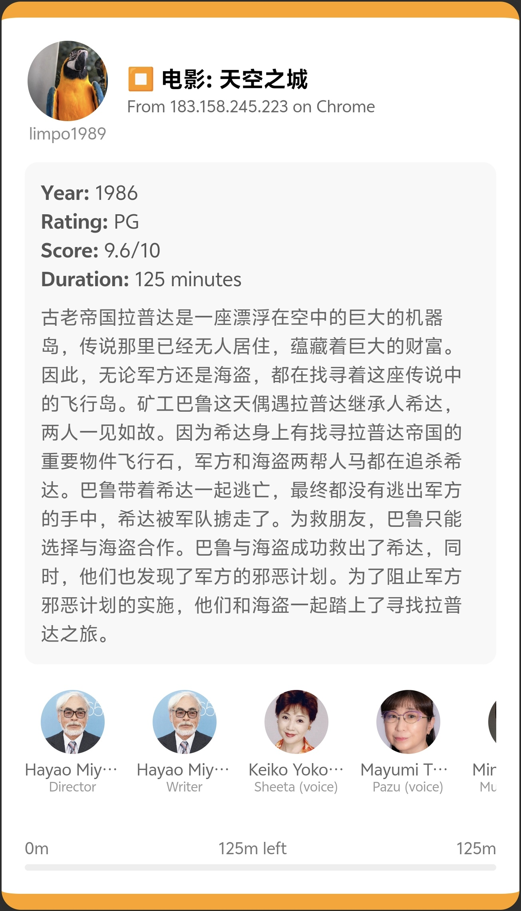

<div align="center">
    <h1>Plex Pusher</h1>
  
</div>

---
```
$ ./plex-pusher --help
NAME:
   plex-pusher - plex event pusher

USAGE:
   plex-pusher [global options] command [command options]

VERSION:
   0.0.1

COMMANDS:
   help, h  Shows a list of commands or help for one command

GLOBAL OPTIONS:
   --listen value                     Specify the host:port to run pusher (default: "0.0.0.0:9876") [%PLEX_PUSHER_LISTEN%]
   --token value                      WxPusher app token [%PLEX_PUSHER_TOKEN%]
   --uid value                        WxPusher app uid [%PLEX_PUSHER_UID%]
   --events value [ --events value ]  Specify the events to be pushed (default: "*") [%PLEX_PUSH_EVENT%]
   --help, -h                         show help
   --version, -v                      print the version
```